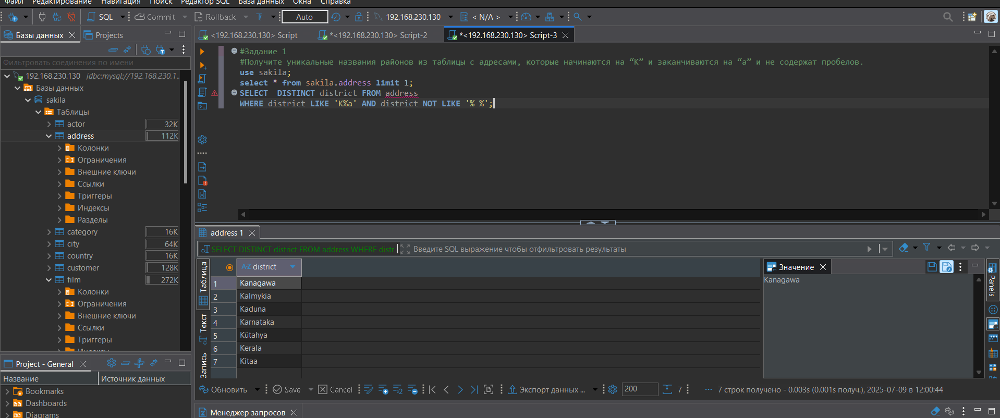
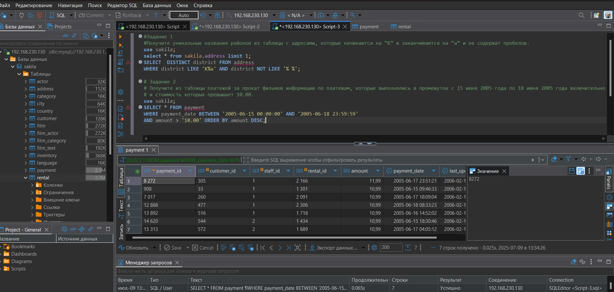
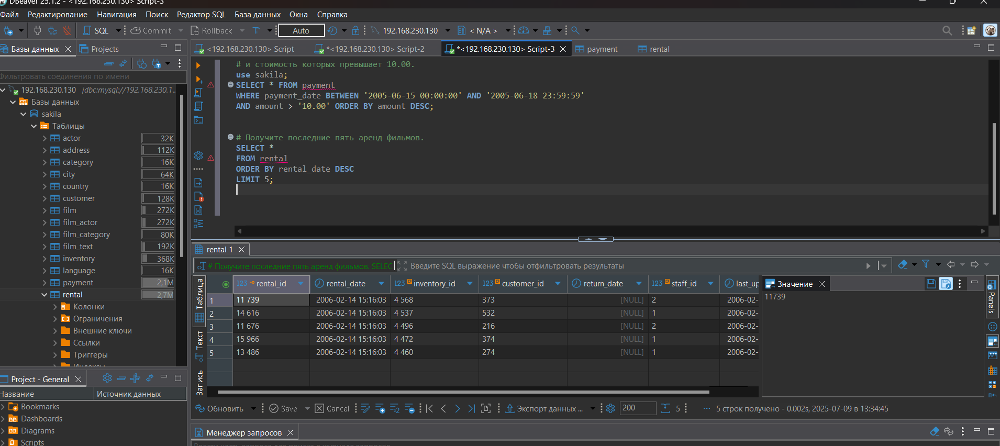
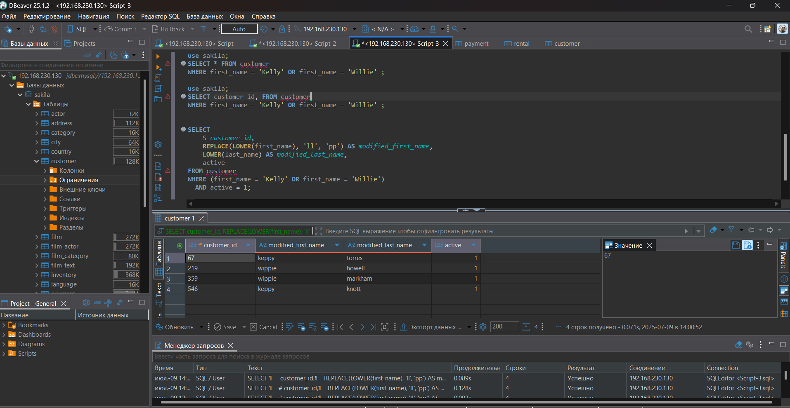
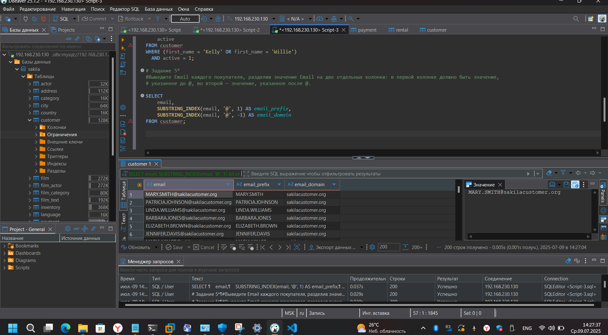
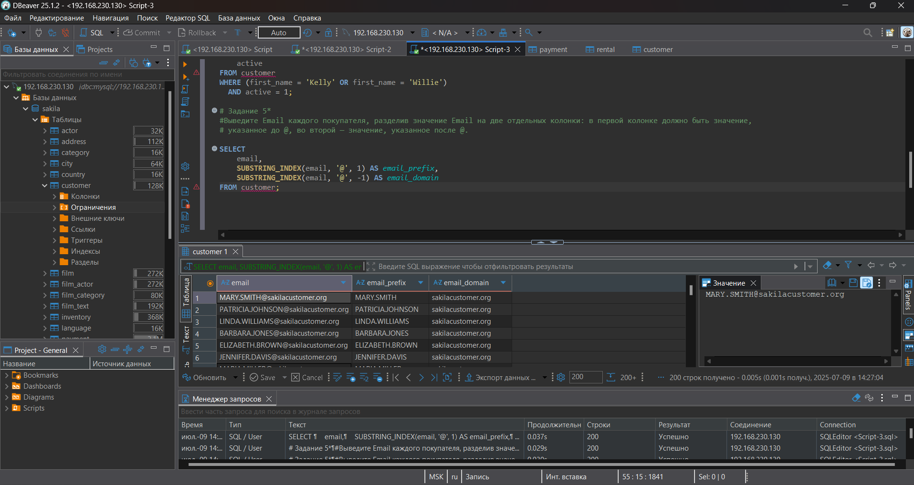

# HOMEWORK_SQL1

## Поднятие чистого инстанса MySQL 8.0+
```
docker run --name mysql8 -e MYSQL_ROOT_PASSWORD=123 -e MYSQL_USER=art -e MYSQL_PASSWORD=123 -p 3306:3306 -d mysql:8.0

```



-- дальше можно работать в консоли:

```
docker exec -it mysql8 mysql -u root -p
```
или 
```
docker exec -it mysql8 mysql -u root -p -e "SELECT user, host FROM mysql.user;"
```



-- а можно в бобре: 



Если плолучили ошибку при подключении 
```
debiver Public Key Retrieval is not allowed 
```
выбираем URL набираем: 
```
jdbc:mysql://192.168.230.130:3306/?allowPublicKeyRetrieval=true&useSSL=false
```





```
use sakila;

```
# Задание 1
Получите уникальные названия районов из таблицы с адресами, которые начинаются на “K” и заканчиваются на “a” и не содержат пробелов.
```
select * from sakila.address limit 1; 
```
```
SELECT 	DISTINCT district FROM address
WHERE district LIKE 'K%a' AND district NOT LIKE '% %';

```
SELECT DISTINCT district - выбирает уникальные значения столбца district
FROM address - из таблицы address
WHERE district LIKE 'K%a' - где название района начинается на K и заканчивается на a
% - любое количество любых символов
AND district NOT LIKE '% %' - и не содержит пробел


# Задание 2
Получите из таблицы платежей за прокат фильмов информацию по платежам, которые выполнялись в промежуток с 15 июня 2005 года по 18 июня 2005 года включительно и стоимость которых превышает 10.00.
```
use sakila;
SELECT * FROM payment 
WHERE payment_date BETWEEN '2005-06-15 00:00:00' AND '2005-06-18 23:59:59'
AND amount > '10.00' ORDER BY amount DESC;
```
SELECT * - выбрать все столбцы
FROM payment - из таблицы payment
WHERE payment_date BETWEEN ... AND ... - где дата платежа в указанном диапазоне
AND amount > 10.00 - и сумма больше 10
ORDER BY payment_date - сортировка по дате платежа


# Задание 3
Получите последние пять аренд фильмов.


```
SELECT * 
FROM rental 
ORDER BY rental_date DESC 
LIMIT 5;
```
SELECT * - выбрать все столбцы
FROM rental - из таблицы rental
ORDER BY rental_date DESC - сортировка по дате аренды в обратном порядке (новые сначала)
LIMIT 5 - ограничить результат 5 записями


# Задание 4
Одним запросом получите активных покупателей, имена которых Kelly или Willie.

Сформируйте вывод в результат таким образом:

все буквы в фамилии и имени из верхнего регистра переведите в нижний регистр,
замените буквы 'll' в именах на 'pp'

```
SELECT 
    customer_id,
    REPLACE(LOWER(first_name), 'll', 'pp') AS modified_first_name,
    LOWER(last_name) AS modified_last_name,
    active
FROM customer 
WHERE (first_name = 'Kelly' OR first_name = 'Willie')
  AND active = 1;
```

REPLACE(LOWER(first_name), 'll', 'pp') - преобразования:
LOWER(first_name) - переводит имя в нижний регистр
REPLACE(..., 'll', 'pp') - заменяет 'll' на 'pp'
LOWER(last_name) - переводит фамилию в нижний регистр
WHERE (first_name = 'Kelly' OR first_name = 'Willie') - где имя Kelly или Willie
AND active = 1 - и покупатель активен


# Задание 5*
Выведите Email каждого покупателя, разделив значение Email на две отдельных колонки: в первой колонке должно быть значение, указанное до @, во второй — значение, указанное после @.
```
SELECT 
    email,
    SUBSTRING_INDEX(email, '@', 1) AS email_prefix,
    SUBSTRING_INDEX(email, '@', -1) AS email_domain
FROM customer;
```
SUBSTRING_INDEX(email, '@', 1) - берет часть строки до первого символа @
SUBSTRING_INDEX(email, '@', -1) - берет часть строки после последнего символа @



# Задание 6*
Доработайте запрос из предыдущего задания, скорректируйте значения в новых колонках: первая буква должна быть заглавной, остальные — строчными.


```
SELECT 
    email,
    CONCAT(
        UPPER(LEFT(SUBSTRING_INDEX(email, '@', 1), 1)),
        LOWER(SUBSTRING(SUBSTRING_INDEX(email, '@', 1), 2)
    ) AS formatted_prefix,
    CONCAT(
        UPPER(LEFT(SUBSTRING_INDEX(email, '@', -1), 1)),
        LOWER(SUBSTRING(SUBSTRING_INDEX(email, '@', -1), 2)
    ) AS formatted_domain
FROM customer;

```
Берет часть email до символа @ (префикс)
Форматирует префикс: первая буква в верхнем регистре, остальные в нижнем
Берет часть email после символа @ (домен)
Форматирует домен: первая буква в верхнем регистре, остальные в нижнем
Возвращает исходный email и две отформатированные части
